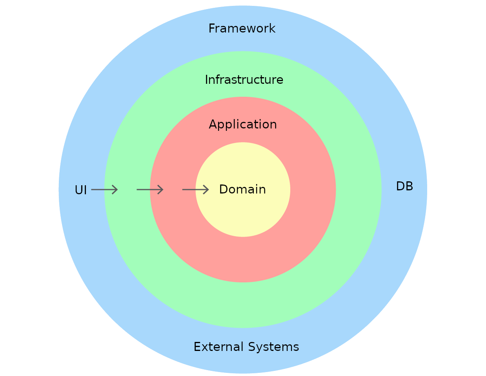
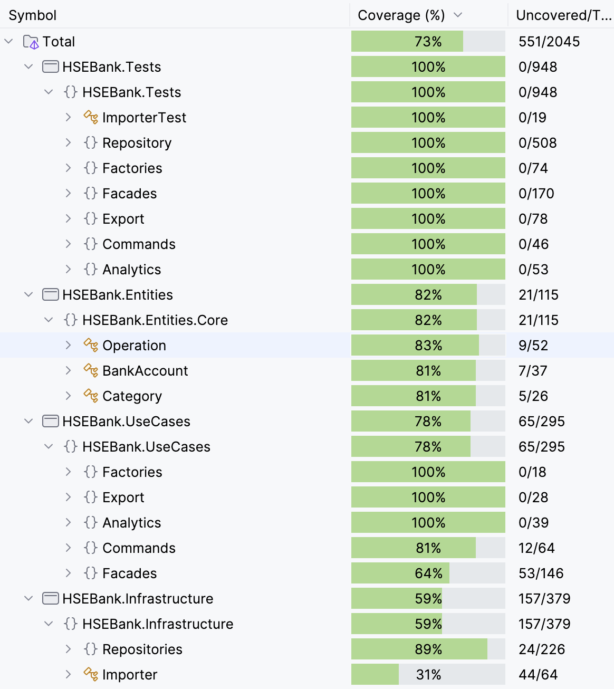

# HSEBank

## Расположение проекта по директориям

Для начала введем читателя в порядок расположения файлов и модулей в проекте.

- Модуль `HSEBank.Entities` отвечает за доменные модели и паттерн Visitor (этот паттерн был расположен здесь намеренно, так как мы не хотим импортировать в доменный модуль другие).
- Модуль `HSEBank.UseCases` определяет все поведение между объектов, при этом оставаясь на некотором уровне абстракции.
- Модуль `HSEBank.Infrastructure` в большинстве своем содержит классы-реализации интерфейсов, расположенных в предыдущем модуле.
- Модуль `HSEBank.Test` содержит **все** тесты.

*Что-то это напоминает... ddd*

## Функционал

Был реализован весь указанный в условии задачи функционал, никаких дополнительных (Use case)'ов не было придумано.

Можно обнаружить недостаток формата импорта/экспорта `csv`, однако, по мнению автора, это слишком неподходящий формат для передачи данных в такого рода системе: хочется передавать все данные одним файлом, а `csv` предоставляет доступ только к одной таблице. Можно создать костыль, но не будем заниматься этим.

## SOLID

### S — Принцип единственной ответственности

Примером принципа единственной ответственности в данном проекте может являться разделение логики хранения (репозиторий) и управления данными (фасады).

### L — Принцип подстановки Лисков

Производные классы могут быть использованы вместо своих базовых классов благодаря принципу подстановки Барбары Лисков. Например, Cached-репозитории могут быть подставлены везде, где ожидается соответствующий интерфейс Repository. (Этот принцип больше про наследование, но мы пытаемся всячески его избегать, поэтому здесь представлена такая вот его интерпретация).

### I — Принцип разделения интерфейса

Интерфейсы программы не нарушают этот принцип, так как ни один из них не является интерфейсом «общего назначения», напротив, создано множество интерфейсов, каждый из которых представляет из себя контракт на реализацию узко специализированных задач.

### D — Принцип инверсии зависимостей

Высокоуровневые классы (фасады, экспортеры и т.д.) зависят от абстракций, а не от конкретных реализаций.

### O — Принцип открытости/закрытости

Этот принцип автоматически выполняется, так как выполнены принципы единственной ответственности и инверсии зависимостей. Действительно, благодаря использованию правильных абстракций существует возможность расширения класса, добавления ему нового поведения, но при этом изначальный код останется «нетронутым».

## Grasp

### High Cohesion

Каждый класс или модуль сосредоточен на выполнении одной четко определенной задачи, тут все так же корректны примеры репозиториев-фасадов (разделение логики хранения-управления данных).

### Low Coupling

Классы или модули должны быть минимально зависимы друг от друга. Это достигается использованием интерфейсов, а не самих классов-реализаций как зависимостей.

### Паттерны

### Фасад

Фасад – поможет объединяет по смыслу несколько методов.
Упакованы в отдельный фасад вся работа с Category, BankAccount, Operation — 
создание, изменение, получение, удаление.

### Команда + Декоратор

Паттерн Команда позволит вам проще определять сценарии и представлять их в виде объектов, которые можно передавать.

Паттерн декоратор в свою очередь позволяет
написать измерение времени работы пользовательского сценария один раз, а
дальше просто оборачивать в этот декоратор сами сценарии - Команды.

### Шаблонный метод 

Шаблонный метод пригождается для экспорта данных в файл различных
форматов. Существует один родительский класс `Exporter`, который открывает/закрывает файл, переводит объекты в `DTO`. Всю остальную работу делают уже конкретные экспортеры, завязанные на конкретном формате.

### Посетитель

Посетитель используется для перевода объектов в `DTO` при условии, что все они лежат в одной коллекции. Для реализации используется механизм двойной диспетчеризации.

### Фабрика

Фабрика гарантирует, что все доменные объекты
создаются в одном и том же месте кода. Это в свою очередь должно помочь
поддержать валидацию этих объектов. Однако в своем коде автор решил делать валидацию в свойствах класса (вдруг доменный объект будет создаваться в обход фабрики). Но здесь появляется простор для фантазии — в фабрике можно расположить какие-нибудь дополнительные методы по валидации данных.

### Прокси

Прокси используется в качестве реализации in-memory кэша.

### Тестовое покрытие

Смотрим на Total)

s